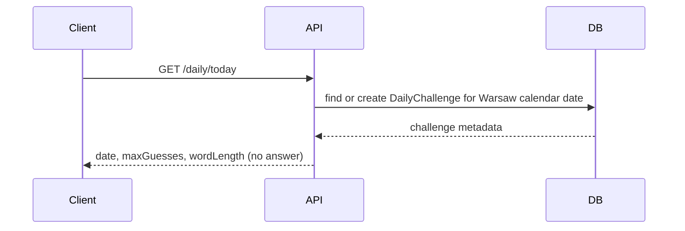
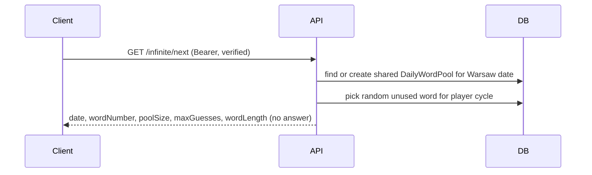

# Wordlopol API — endpoints & testing

Base URL (local): `http://localhost:3001`

All JSON request/response bodies unless noted. Errors: `{ "error": "<message>" }`.

---

## Auth flow overview


### Token model

| Token          | Storage                         | Lifetime | Used for                             |
| -------------- | ------------------------------- | -------- | ------------------------------------ |
| Access JWT     | Client memory / Postman env     | 15 min   | `Authorization: Bearer <token>`      |
| Refresh token  | httpOnly cookie `refresh_token` | 7 days   | `POST /auth/refresh`, `/auth/logout` |
| Email verify   | Email link → body token         | 24 h     | `POST /auth/verify-email`            |
| Password reset | Email link → body token         | 1 h      | `POST /auth/reset-password`          |
| Email change   | Email link → body token (JWT)   | 24 h     | `POST /auth/verify-email`            |

Refresh tokens are stored as **SHA-256 hashes** in the database (never plaintext). Each refresh **rotates** the token (old one invalidated).

---

## Endpoints

### Health

| Method | Path      | Auth | Description                             |
| ------ | --------- | ---- | --------------------------------------- |
| GET    | `/health` | —    | DB connectivity + dictionary word count |

**200**

```json
{ "status": "ok", "database": "connected", "wordCount": 4062 }
```

**503** — database unreachable

```json
{ "status": "degraded", "database": "disconnected" }
```

---

### Auth — public

| Method | Path                        | Body                               | Success                                                       |
| ------ | --------------------------- | ---------------------------------- | ------------------------------------------------------------- |
| POST   | `/auth/register`            | `{ email, password, displayName }` | **201** `{ message }` (+ `devToken` in development only)      |
| POST   | `/auth/verify-email`        | `{ token }`                        | **200** `{ message }`                                         |
| POST   | `/auth/login`               | `{ email, password }`              | **200** `{ accessToken, user }` + `Set-Cookie: refresh_token` |
| POST   | `/auth/resend-verification` | `{ email }`                        | **200** `{ message }` (+ `devToken` in dev when email sent)   |
| POST   | `/auth/forgot-password`     | `{ email }`                        | **200** `{ message }` (+ `devToken` in dev when email sent)   |
| POST   | `/auth/reset-password`      | `{ token, password }`              | **200** `{ message }`                                         |

Rate-limited (15 min window): `register` (5), `login` (10), `resend-verification` (5), `forgot-password` (5) per IP. **Disabled in `development` and `test`.**

**Validation**

- `password` min 8 chars on register / reset
- `email` must be valid format
- `displayName` required, 1–50 chars after trim

**Development-only `devToken`**

When `NODE_ENV=development`, token-bearing auth endpoints also return `devToken` in the JSON body so Postman can run the full collection without copying from logs or email. **Never present in production or test.**

```json
{ "message": "Verification email sent", "devToken": "64-char-hex-or-jwt" }
```

Endpoints that may include `devToken`: `register`, `resend-verification`, `forgot-password`, `change-email` (only when an email would actually be sent).

**login response**

```json
{
  "accessToken": "...",
  "user": {
    "id": "...",
    "email": "player@example.com",
    "displayName": "Player",
    "emailVerified": true
  }
}
```

**verify-email responses**

- `{ "message": "Email verified" }` — initial registration
- `{ "message": "Email changed" }` — email-change confirmation (same endpoint)

---

### Auth — refresh cookie

These endpoints read the `refresh_token` cookie (path `/auth`). No Bearer token required.

| Method | Path            | Success                                              |
| ------ | --------------- | ---------------------------------------------------- |
| POST   | `/auth/refresh` | **200** `{ accessToken }` + new cookie               |
| POST   | `/auth/logout`  | **200** `{ message: "Logged out" }` + cookie cleared |

---

### Auth — Bearer token required

Send header: `Authorization: Bearer <accessToken>`

| Method | Path                        | Body                               | Success                                                  |
| ------ | --------------------------- | ---------------------------------- | -------------------------------------------------------- |
| POST   | `/auth/logout-all`          | —                                  | **200** `{ message }` + cookie cleared                   |
| PATCH  | `/auth/change-display-name` | `{ displayName }`                  | **200** `{ user }`                                       |
| PATCH  | `/auth/change-password`     | `{ currentPassword, newPassword }` | **200** `{ message }`                                    |
| PATCH  | `/auth/change-email`        | `{ newEmail }`                     | **200** `{ message }` (+ `devToken` in development only) |
| DELETE | `/auth/account`             | `{ password }`                     | **200** `{ message }`                                    |

`change-password`, `logout-all`, and `account` delete also revoke refresh sessions server-side.

---

### Daily challenge

| Method | Path           | Auth | Description                            |
| ------ | -------------- | ---- | -------------------------------------- |
| GET    | `/daily/today` | —    | Today's challenge metadata (no answer) |

Calendar day uses `Europe/Warsaw` (`TZ` env). The word is chosen deterministically from the dictionary and persisted lazily on first request for that date.

**200**

```json
{
  "date": "2026-06-06",
  "maxGuesses": 6,
  "wordLength": 5
}
```

**503** — dictionary empty (no words imported)

```json
{ "error": "Dictionary not loaded" }
```

The response never includes the answer.

---

### Infinite mode

| Method | Path             | Auth                    | Description                          |
| ------ | ---------------- | ----------------------- | ------------------------------------ |
| GET    | `/infinite/next` | Bearer + verified email | Next word metadata from today's pool |

Requires `authenticate` and `requireVerified`. Guests and unverified users cannot access infinite mode.

Each Warsaw calendar day has one **shared pool** of up to 300 five-letter words (`INFINITE_POOL_SIZE`), lazy-created in `DailyWordPool`. Per player, words are drawn randomly without duplicates within a cycle; when the pool is exhausted the player starts a new cycle over the same word set in a different order.

Repeated calls while a word is in progress return the same `wordNumber` (refresh-safe). The answer is never included.

**200**

```json
{
  "date": "2026-06-06",
  "wordNumber": 1,
  "poolSize": 300,
  "maxGuesses": 6,
  "wordLength": 5
}
```

**401** — missing or invalid Bearer token

```json
{ "error": "Unauthorized" }
```

**403** — email not verified

```json
{ "error": "Email not verified" }
```

**503** — dictionary empty (no words imported)

```json
{ "error": "Dictionary not loaded" }
```

---

## Common error codes

| Status | When                                                 |
| ------ | ---------------------------------------------------- |
| 400    | Invalid body / expired or invalid token              |
| 401    | Missing or invalid Bearer / refresh token / password |
| 403    | Email not verified (login, `/infinite/next`)         |
| 404    | User not found                                       |
| 409    | Email already registered                             |
| 429    | Rate limit exceeded on auth endpoints                |
| 503    | DB down, email delivery failed, or empty dictionary  |

---

## Postman setup guide

### Quick start (import ready-made collection)

Files in `apps/api/postman/`:

| File                                                  | Import as                   |
| ----------------------------------------------------- | --------------------------- |
| `Wordlopol-Local.postman_environment.json`            | Environment                 |
| `Wordlopol-Auth.postman_collection.json`              | Collection (auth)           |
| `Wordlopol-Auth-Negative.postman_collection.json`     | Collection (auth edges)     |
| `Wordlopol-Daily.postman_collection.json`             | Collection (daily)          |
| `Wordlopol-Infinite.postman_collection.json`          | Collection (infinite)       |
| `Wordlopol-Infinite-Negative.postman_collection.json` | Collection (infinite edges) |

1. Postman → **Import** → select the environment and collections you need (all six files for full coverage)
2. Select environment **Wordlopol Local** (top-right dropdown)
3. Ensure API is running: `pnpm --filter @wordlopol/api dev`
4. Open a collection (e.g. **Wordlopol Auth (automated)**) → **Run**
5. Run requests in order — tokens and variables are saved automatically via Tests scripts

See [postman/README.md](../postman/README.md) for per-collection run instructions (auth, daily, infinite).

**What gets saved automatically:**

| After request          | Environment variable | Source                    |
| ---------------------- | -------------------- | ------------------------- |
| 01 Register            | `verify_token`       | `response.devToken`       |
| 03 Login               | `access_token`       | `response.accessToken`    |
| 04 Refresh             | `access_token`       | updated access token      |
| 07 Forgot password     | `reset_token`        | `response.devToken`       |
| 08 Reset password      | `password`           | set to `new-password`     |
| 10 Change password     | `password`           | set to `changed-password` |
| 11 Change email        | `email_change_token` | `response.devToken`       |
| 12 Verify email change | `email`              | updated to `new_email`    |

Collection **Pre-request Script** (first request only) sets fresh `email`, `new_email`, `password`, `display_name` and clears stale tokens.

To verify variables mid-run: **Environments → Wordlopol Local → eye icon**, or open Postman **Console** (View → Show Postman Console).

### Manual setup (alternative)

### 1. Prerequisites

```bash
docker compose up -d
pnpm db:migrate
pnpm db:import-words   # optional for health wordCount
pnpm --filter @wordlopol/api dev
```

API runs at `http://localhost:3001`. Ensure `NODE_ENV=development` (default) so `devToken` is returned for automated Postman runs.

### 2. Environment variables

Create environment **Wordlopol Local**:

| Variable             | Initial value           | Set by                                        | Used for                         |
| -------------------- | ----------------------- | --------------------------------------------- | -------------------------------- |
| `base_url`           | `http://localhost:3001` | you                                           | all requests                     |
| `display_name`       | `Player`                | collection Pre-request Script                 | register                         |
| `email`              | _(auto)_                | collection Pre-request Script                 | register, login, forgot-password |
| `new_email`          | _(auto)_                | collection Pre-request Script                 | change-email                     |
| `password`           | `secure-password`       | collection script; steps 8 & 10 Tests scripts | login, change-password, delete   |
| `access_token`       | _(empty)_               | login Tests script (step 3)                   | Bearer on steps 6, 9–13          |
| `verify_token`       | _(empty)_               | register Tests script (step 1)                | verify-email (step 2)            |
| `reset_token`        | _(empty)_               | forgot-password Tests script (step 7)         | reset-password (step 8)          |
| `email_change_token` | _(empty)_               | change-email Tests script (step 11)           | verify-email (step 12)           |

You only need to set `base_url` manually — the collection scripts populate the rest on each run.

### 3. Collection settings

| Setting       | Value                                                            |
| ------------- | ---------------------------------------------------------------- |
| Cookie jar    | **Enabled** (default) — login sets `refresh_token` automatically |
| Cookie path   | `/auth` — sent on all `{{base_url}}/auth/*` requests             |
| Bearer routes | Authorization → **Bearer Token** → `{{access_token}}`            |
| Content-Type  | `application/json` on all POST/PATCH/DELETE with body            |

### 4. Collection Pre-request Script

Add at **collection** level (runs once per collection run):

```javascript
if (!pm.collectionVariables.get('run_initialized')) {
  const runId = Date.now();
  pm.environment.set('email', `player-${runId}@example.com`);
  pm.environment.set('new_email', `new-player-${runId}@example.com`);
  pm.environment.set('password', 'secure-password');
  pm.environment.set('display_name', 'Player');
  pm.collectionVariables.set('run_initialized', 'true');
}
```

### 5. Automated collection (14 requests)

Run with **Collection Runner** in order. No manual token copying.

| #   | Name                | Method | Path                        | Auth   | Body                                                                                      |
| --- | ------------------- | ------ | --------------------------- | ------ | ----------------------------------------------------------------------------------------- |
| —   | Health              | GET    | `/health`                   | —      | _(none)_                                                                                  |
| 1   | Register            | POST   | `/auth/register`            | —      | `{ "email": "{{email}}", "password": "{{password}}", "displayName": "{{display_name}}" }` |
| 2   | Verify email        | POST   | `/auth/verify-email`        | —      | `{ "token": "{{verify_token}}" }`                                                         |
| 3   | Login               | POST   | `/auth/login`               | —      | `{ "email": "{{email}}", "password": "{{password}}" }`                                    |
| 4   | Refresh             | POST   | `/auth/refresh`             | Cookie | _(none)_                                                                                  |
| 5   | Logout              | POST   | `/auth/logout`              | Cookie | _(none)_                                                                                  |
| 6   | Logout all          | POST   | `/auth/logout-all`          | Bearer | _(none)_                                                                                  |
| 7   | Forgot password     | POST   | `/auth/forgot-password`     | —      | `{ "email": "{{email}}" }`                                                                |
| 8   | Reset password      | POST   | `/auth/reset-password`      | —      | `{ "token": "{{reset_token}}", "password": "new-password" }`                              |
| 9   | Change display name | PATCH  | `/auth/change-display-name` | Bearer | `{ "displayName": "Updated Player" }`                                                     |
| 10  | Change password     | PATCH  | `/auth/change-password`     | Bearer | `{ "currentPassword": "{{password}}", "newPassword": "changed-password" }`                |
| 11  | Change email        | PATCH  | `/auth/change-email`        | Bearer | `{ "newEmail": "{{new_email}}" }`                                                         |
| 12  | Verify email change | POST   | `/auth/verify-email`        | —      | `{ "token": "{{email_change_token}}" }`                                                   |
| 13  | Delete account      | DELETE | `/auth/account`             | Bearer | `{ "password": "{{password}}" }`                                                          |

**Password chain:** step 8 → `new-password` · step 10 → `changed-password` · step 13 uses `{{password}}` (= `changed-password` after step 10 script).

### 6. Tests scripts

Shared helper — paste at the top of each script that captures a token, or duplicate the two lines inline:

```javascript
function saveDevToken(envVar) {
  const { devToken } = pm.response.json();
  pm.test(`${envVar} set from devToken`, () => pm.expect(devToken).to.be.a('string').and.not.empty);
  pm.environment.set(envVar, devToken);
}
```

**Register (step 1):**

```javascript
pm.test('201', () => pm.response.to.have.status(201));
saveDevToken('verify_token');
```

**Verify email (step 2):**

```javascript
pm.test('200', () => pm.response.to.have.status(200));
pm.test('Email verified', () => pm.expect(pm.response.json().message).to.eql('Email verified'));
```

**Login (step 3):**

```javascript
pm.test('200', () => pm.response.to.have.status(200));
const { accessToken, user } = pm.response.json();
pm.environment.set('access_token', accessToken);
pm.test('user profile', () => {
  pm.expect(user.email).to.eql(pm.environment.get('email'));
  pm.expect(user.displayName).to.be.a('string').and.not.empty;
  pm.expect(user.emailVerified).to.be.true;
});
pm.test('refresh cookie', () => pm.expect(pm.cookies.has('refresh_token')).to.be.true);
```

**Forgot password (step 7):**

```javascript
pm.test('200', () => pm.response.to.have.status(200));
saveDevToken('reset_token');
```

**Reset password (step 8):**

```javascript
pm.test('200', () => pm.response.to.have.status(200));
pm.test('Password reset', () => {
  pm.expect(pm.response.json().message).to.eql('Password reset');
});
pm.environment.set('password', 'new-password');
```

**Change password (step 10):**

```javascript
pm.test('200', () => pm.response.to.have.status(200));
pm.environment.set('password', 'changed-password');
```

**Change email (step 11):**

```javascript
pm.test('200', () => pm.response.to.have.status(200));
saveDevToken('email_change_token');
```

**Verify email change (step 12):**

```javascript
pm.test('200', () => pm.response.to.have.status(200));
pm.environment.set('email', pm.environment.get('new_email'));
```

### 7. Postman tips

| Topic              | Note                                                                                                               |
| ------------------ | ------------------------------------------------------------------------------------------------------------------ |
| Auth types         | **None** = public · **Cookie** = `refresh_token` auto-sent · **Bearer** = `Authorization: Bearer {{access_token}}` |
| Cookie vs Bearer   | Steps 4–5 need cookie (run before logout clears it). Steps 6, 9–13 need Bearer from step 3                         |
| Password chain     | After step 8 → `new-password`; after step 10 → `changed-password` (step 13 delete uses this)                       |
| No re-login needed | Same `access_token` from step 3 works for all Bearer steps if run within 15 min                                    |
| Rate limits        | Disabled in `development` and `test`; active in production                                                         |

---

## Daily challenge flow



### Postman collection

Import `Wordlopol-Daily.postman_collection.json` with the same **Wordlopol Local** environment as auth.

| #   | Request            | Expect                      |
| --- | ------------------ | --------------------------- |
| 00  | GET `/health`      | 200, `wordCount > 0`        |
| 01  | GET `/daily/today` | 200, saves `daily_date`     |
| 02  | GET `/daily/today` | 200, same `date` as step 01 |

**503 empty dictionary** — only reproducible with an empty `Word` table (covered by Vitest, not the Postman happy path).

---

## Infinite mode flow



### Postman collection

Import `Wordlopol-Infinite.postman_collection.json` with the same **Wordlopol Local** environment as auth.

| #   | Request                   | Expect                                   |
| --- | ------------------------- | ---------------------------------------- |
| 00  | GET `/health`             | 200, init user, `wordCount > 0`          |
| 01  | POST `/auth/register`     | 201, saves `verify_token`                |
| 02  | POST `/auth/verify-email` | 200                                      |
| 03  | POST `/auth/login`        | 200, saves `access_token`                |
| 04  | GET `/infinite/next`      | 200, saves `infinite_date`, `wordNumber` |
| 05  | GET `/infinite/next`      | 200, same date and `wordNumber` as 04    |

Edge cases: `Wordlopol-Infinite-Negative.postman_collection.json` — 401 without Bearer, 403 unverified login.

---

## Security review (current branch)

### Implemented

- bcrypt (cost 12) for passwords
- Separate JWT secrets for access vs refresh/email-change
- Production boot fails on placeholder or identical JWT secrets
- Short access TTL (15 min)
- Refresh tokens hashed at rest; rotation on refresh
- Session revocation on logout, logout-all, password change/reset, email change
- httpOnly + SameSite=lax refresh cookie; `Secure` in production
- Helmet HTTP headers
- CORS restricted to `APP_URL` with credentials
- Rate limiting on register, login, forgot-password, resend-verification
- Forgot-password / resend-verification do not reveal whether email exists
- Previous password-reset tokens invalidated on new forgot-password request
- `POST /auth/resend-verification` for stuck unverified accounts
- 73 automated integration tests + 4 e2e (health, auth, daily, infinite, tokens, middleware)
- Daily challenge: deterministic word per Warsaw calendar day; lazy DB persistence on `GET /daily/today`
- Infinite mode: shared daily word pool; `requireVerified` wired on `GET /infinite/next`; answer never exposed

### Remaining gaps

| Item                              | Risk     | Notes                                                                       |
| --------------------------------- | -------- | --------------------------------------------------------------------------- |
| **Access JWT not revocable**      | Low      | By design; 15 min window; refresh revocation stops renewal                  |
| **Email change without password** | Low      | Authenticated user can request change with only Bearer token                |
| **`optionalAuth`**                | —        | Middleware exists but not wired to daily guest routes yet (expected)        |
| **Guess endpoints**               | —        | `POST /infinite/guess` and `POST /daily/guess` not implemented yet (step 6) |
| **devToken in responses**         | Dev only | Returned only when `NODE_ENV=development`; omitted in production and test   |

---

## Postman quick checklist

See [Postman setup guide](#postman-setup-guide) for the automated collection, scripts, and environment setup.

| #   | Method | Path                        | Auth              |
| --- | ------ | --------------------------- | ----------------- |
| —   | GET    | `/health`                   | —                 |
| —   | GET    | `/daily/today`              | —                 |
| —   | GET    | `/infinite/next`            | Bearer + verified |
| 1   | POST   | `/auth/register`            | —                 |
| 2   | POST   | `/auth/verify-email`        | —                 |
| 3   | POST   | `/auth/login`               | —                 |
| 4   | POST   | `/auth/refresh`             | Cookie            |
| 5   | POST   | `/auth/logout`              | Cookie            |
| 6   | POST   | `/auth/logout-all`          | Bearer            |
| 7   | POST   | `/auth/forgot-password`     | —                 |
| 8   | POST   | `/auth/reset-password`      | —                 |
| 9   | PATCH  | `/auth/change-display-name` | Bearer            |
| 10  | PATCH  | `/auth/change-password`     | Bearer            |
| 11  | PATCH  | `/auth/change-email`        | Bearer            |
| 12  | POST   | `/auth/verify-email`        | —                 |
| 13  | DELETE | `/auth/account`             | Bearer            |

**Negative cases worth spot-checking:**

| Method | Path                        | Expect                      |
| ------ | --------------------------- | --------------------------- |
| POST   | `/auth/login`               | 403 before verify-email     |
| POST   | `/auth/register`            | 400 missing displayName     |
| POST   | `/auth/register`            | 409 duplicate email         |
| POST   | `/auth/refresh`             | 401 after logout            |
| PATCH  | `/auth/change-display-name` | 400 unchanged or blank name |
| PATCH  | `/auth/change-password`     | 401 wrong current password  |
| DELETE | `/auth/account`             | 401 wrong password          |
| GET    | `/daily/today`              | 503 empty dictionary        |
| GET    | `/infinite/next`            | 401 without Bearer          |
| GET    | `/infinite/next`            | 403 unverified user         |

---

## Test coverage summary

### Prerequisites

- Postgres running on port **5433** (`docker compose up -d` from repo root)
- Test database `wordlopol_test` on that instance — created and migrated automatically by Vitest global setup (`src/test/global-setup.ts`)
- Resend is **not** called during tests; email helpers are mocked in auth suites

### Suites

| Suite                          | Location         | Tests                                          |
| ------------------------------ | ---------------- | ---------------------------------------------- |
| `health.test.ts`               | `src/__tests__/` | DB connected / empty / degraded                |
| `tokens.test.ts`               | `src/__tests__/` | JWT + refresh create/rotate/revoke             |
| `middleware.test.ts`           | `src/__tests__/` | authenticate, optionalAuth, requireVerified    |
| `email.test.ts`                | `src/__tests__/` | URL builders + send behavior                   |
| `auth-register.test.ts`        | `src/__tests__/` | register → verify → login, resend-verification |
| `auth-session.test.ts`         | `src/__tests__/` | refresh, logout, logout-all                    |
| `auth-account.test.ts`         | `src/__tests__/` | reset, change-password, change-email, delete   |
| `tokens-email-change.test.ts`  | `src/__tests__/` | email-change JWT                               |
| `daily-word-picker.test.ts`    | `src/__tests__/` | deterministic word index picker                |
| `daily-today.test.ts`          | `src/__tests__/` | GET /daily/today, idempotency, empty dict 503  |
| `infinite-pool-picker.test.ts` | `src/__tests__/` | seeded shuffle and pool index picker           |
| `infinite-pool.test.ts`        | `src/__tests__/` | shared pool creation, idempotency, 503         |
| `infinite-next.test.ts`        | `src/__tests__/` | GET /infinite/next auth, cycles, no answer     |
| `health.e2e.ts`                | `src/__e2e__/`   | health over real HTTP                          |
| `auth.e2e.ts`                  | `src/__e2e__/`   | register → verify → login → refresh over HTTP  |
| `daily.e2e.ts`                 | `src/__e2e__/`   | daily today over real HTTP                     |
| `infinite.e2e.ts`              | `src/__e2e__/`   | infinite next over real HTTP                   |

**Integration** — Supertest against an in-process Express app (`vitest.config.ts`).

```bash
pnpm test                    # from repo root (turbo)
pnpm --filter @wordlopol/api test
```

**Coverage** — v8 provider; text summary in terminal, HTML + lcov in `apps/api/coverage/` (gitignored). Current baseline ~87% statements on `src/` (excludes tests, e2e helpers, generated code).

```bash
pnpm test:coverage
pnpm --filter @wordlopol/api test:coverage
```

**E2E** — real HTTP server on `127.0.0.1:<random port>` (`vitest.e2e.config.ts`). The app is loaded via dynamic import so Vitest email mocks apply before routes bind.

```bash
pnpm test:e2e
pnpm --filter @wordlopol/api test:e2e
```

**All tests** — integration then e2e; this is what CI runs after `prisma migrate deploy` against the test DB.

```bash
pnpm test:all
```
