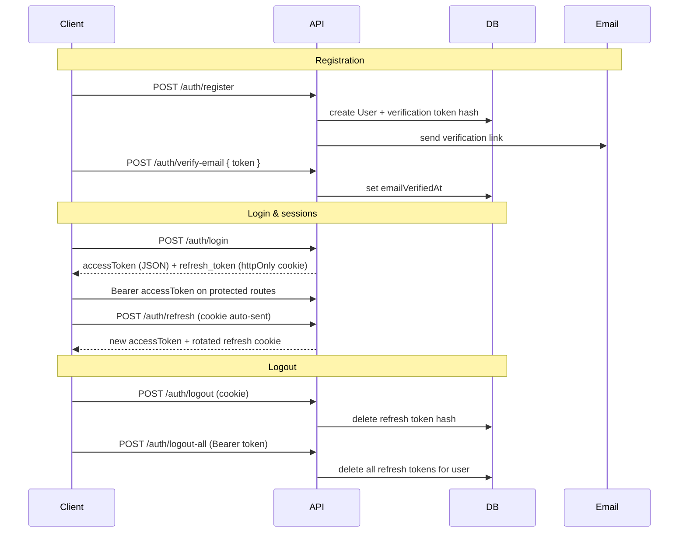

# Wordlopol API — endpoints & testing

Base URL (local): `http://localhost:3001`

All JSON request/response bodies unless noted. Errors: `{ "error": "<message>" }`.

---

## Auth flow overview



### Token model

| Token          | Storage                         | Lifetime | Used for                             |
| -------------- | ------------------------------- | -------- | ------------------------------------ |
| Access JWT     | Client memory / Postman env     | 15 min   | `Authorization: Bearer <token>`      |
| Refresh token  | httpOnly cookie `refresh_token` | 7 days   | `POST /auth/refresh`, `/auth/logout` |
| Email verify   | Email link → body token         | 24 h     | `POST /auth/verify-email`            |
| Password reset | Email link → body token         | 1 h      | `POST /auth/reset-password`          |
| Email change   | Email link → body token (JWT)   | 24 h     | `POST /auth/verify-email`            |

Refresh tokens are stored as **SHA-256 hashes** in the database (never plaintext). Each refresh **rotates** the token (old one invalidated).

---

## Endpoints

### Health

| Method | Path      | Auth | Description                             |
| ------ | --------- | ---- | --------------------------------------- |
| GET    | `/health` | —    | DB connectivity + dictionary word count |

**200**

```json
{ "status": "ok", "database": "connected", "wordCount": 4062 }
```

**503** — database unreachable

```json
{ "status": "degraded", "database": "disconnected" }
```

---

### Auth — public

| Method | Path                        | Body                                | Success                                                 |
| ------ | --------------------------- | ----------------------------------- | ------------------------------------------------------- |
| POST   | `/auth/register`            | `{ email, password, displayName? }` | **201** `{ message }`                                   |
| POST   | `/auth/verify-email`        | `{ token }`                         | **200** `{ message }`                                   |
| POST   | `/auth/login`               | `{ email, password }`               | **200** `{ accessToken }` + `Set-Cookie: refresh_token` |
| POST   | `/auth/resend-verification` | `{ email }`                         | **200** `{ message }` (always same text)                |
| POST   | `/auth/forgot-password`     | `{ email }`                         | **200** `{ message }` (always same text)                |
| POST   | `/auth/reset-password`      | `{ token, password }`               | **200** `{ message }`                                   |

Rate-limited (15 min window): `register` (5), `login` (10), `resend-verification` (5), `forgot-password` (5) per IP.

**Validation**

- `password` min 8 chars on register / reset
- `email` must be valid format

**verify-email responses**

- `{ "message": "Email verified" }` — initial registration
- `{ "message": "Email changed" }` — email-change confirmation (same endpoint)

---

### Auth — refresh cookie

These endpoints read the `refresh_token` cookie (path `/auth`). No Bearer token required.

| Method | Path            | Success                                              |
| ------ | --------------- | ---------------------------------------------------- |
| POST   | `/auth/refresh` | **200** `{ accessToken }` + new cookie               |
| POST   | `/auth/logout`  | **200** `{ message: "Logged out" }` + cookie cleared |

---

### Auth — Bearer token required

Send header: `Authorization: Bearer <accessToken>`

| Method | Path                    | Body                               | Success                                |
| ------ | ----------------------- | ---------------------------------- | -------------------------------------- |
| POST   | `/auth/logout-all`      | —                                  | **200** `{ message }` + cookie cleared |
| PATCH  | `/auth/change-password` | `{ currentPassword, newPassword }` | **200** `{ message }`                  |
| PATCH  | `/auth/change-email`    | `{ newEmail }`                     | **200** `{ message }`                  |
| DELETE | `/auth/account`         | `{ password }`                     | **200** `{ message }`                  |

`change-password`, `logout-all`, and `account` delete also revoke refresh sessions server-side.

---

## Common error codes

| Status | When                                                 |
| ------ | ---------------------------------------------------- |
| 400    | Invalid body / expired or invalid token              |
| 401    | Missing or invalid Bearer / refresh token / password |
| 403    | Email not verified (login)                           |
| 404    | User not found                                       |
| 409    | Email already registered                             |
| 429    | Rate limit exceeded on auth endpoints                |
| 503    | Health — DB down                                     |

---

## Postman setup guide

### 1. Prerequisites

```bash
docker compose up -d
pnpm db:migrate
pnpm db:import-words   # optional for health wordCount
pnpm --filter @wordlopol/api dev
```

### 2. Environment

Create a Postman environment **Wordlopol Local**:

| Variable       | Value                             |
| -------------- | --------------------------------- |
| `base_url`     | `http://localhost:3001`           |
| `access_token` | _(empty — filled by scripts)_     |
| `verify_token` | _(empty — copy from server logs)_ |
| `reset_token`  | _(empty — copy from server logs)_ |

### 3. Collection settings

1. Set collection variable `base_url` → `{{base_url}}`
2. **Cookies**: leave Postman's cookie jar **enabled** (default). Login stores `refresh_token` automatically.
3. For Bearer routes, set Authorization → **Bearer Token** → `{{access_token}}`

### 4. Request collection (suggested order)

#### Health

- `GET {{base_url}}/health`

#### Register → verify → login

**POST** `{{base_url}}/auth/register`

```json
{
  "email": "player@example.com",
  "password": "secure-password",
  "displayName": "Player"
}
```

**Get verification token (dev without Resend)**

Without `RESEND_API_KEY`, the API logs the email to the terminal:

```
[email] To: player@example.com
Subject: Potwierdź adres e-mail — Wordlopol
...token=abc123...
```

Copy the `token` query value into `verify_token`.

**POST** `{{base_url}}/auth/resend-verification` _(if email not received)_

```json
{ "email": "player@example.com" }
```

**POST** `{{base_url}}/auth/verify-email`

```json
{ "token": "{{verify_token}}" }
```

**POST** `{{base_url}}/auth/login`

```json
{
  "email": "player@example.com",
  "password": "secure-password"
}
```

**Tests script** (login request → save token):

```javascript
const json = pm.response.json();
if (json.accessToken) {
  pm.environment.set('access_token', json.accessToken);
}
```

#### Refresh & logout

**POST** `{{base_url}}/auth/refresh` — no body; cookie sent automatically.

**POST** `{{base_url}}/auth/logout` — clears session cookie.

**POST** `{{base_url}}/auth/logout-all` — requires Bearer `{{access_token}}`.

#### Password reset

**POST** `{{base_url}}/auth/forgot-password`

```json
{ "email": "player@example.com" }
```

Copy `reset_token` from server log (same as verify flow).

**POST** `{{base_url}}/auth/reset-password`

```json
{
  "token": "{{reset_token}}",
  "password": "new-secure-password"
}
```

#### Authenticated settings

**PATCH** `{{base_url}}/auth/change-password` — Bearer token

```json
{
  "currentPassword": "secure-password",
  "newPassword": "new-secure-password"
}
```

**PATCH** `{{base_url}}/auth/change-email` — Bearer token

```json
{ "newEmail": "new-player@example.com" }
```

Copy JWT from log → **POST** `/auth/verify-email` with that token.

**DELETE** `{{base_url}}/auth/account` — Bearer token

```json
{ "password": "new-secure-password" }
```

### 5. Postman tips

| Topic                | Note                                                                                        |
| -------------------- | ------------------------------------------------------------------------------------------- |
| Cookies              | `refresh_token` path is `/auth` — sent on all `/auth/*` requests                            |
| CORS                 | Postman ignores CORS; browser clients must use `APP_URL` origin with `credentials: include` |
| Re-login             | After `change-password` or `reset-password`, old refresh cookies are invalid — login again  |
| Expired access token | Call `/auth/refresh` before protected routes                                                |

---

## Security review (current branch)

### Implemented

- bcrypt (cost 12) for passwords
- Separate JWT secrets for access vs refresh/email-change
- Production boot fails on placeholder or identical JWT secrets
- Short access TTL (15 min)
- Refresh tokens hashed at rest; rotation on refresh
- Session revocation on logout, logout-all, password change/reset, email change
- httpOnly + SameSite=lax refresh cookie; `Secure` in production
- Helmet HTTP headers
- CORS restricted to `APP_URL` with credentials
- Rate limiting on register, login, forgot-password, resend-verification
- Forgot-password / resend-verification do not reveal whether email exists
- Previous password-reset tokens invalidated on new forgot-password request
- `POST /auth/resend-verification` for stuck unverified accounts
- 36 automated tests — 34 integration + 2 e2e (health, tokens, middleware, auth flows)

### Remaining gaps

| Item                                   | Risk     | Notes                                                         |
| -------------------------------------- | -------- | ------------------------------------------------------------- |
| **Access JWT not revocable**           | Low      | By design; 15 min window; refresh revocation stops renewal    |
| **Email change without password**      | Low      | Authenticated user can request change with only Bearer token  |
| **`optionalAuth` / `requireVerified`** | —        | Middleware exists but not wired to game routes yet (expected) |
| **Email delivery in dev**              | Dev only | Tokens logged to console — configure Resend in production     |

---

## Postman test checklist

Test in this order. Base URL: `http://localhost:3001`. Enable cookie jar.

| #   | Method | Path                        | Auth   | Body / notes                                 |
| --- | ------ | --------------------------- | ------ | -------------------------------------------- |
| 1   | GET    | `/health`                   | —      | Expect 200 + `wordCount`                     |
| 2   | POST   | `/auth/register`            | —      | `{ email, password, displayName? }`          |
| 3   | POST   | `/auth/resend-verification` | —      | `{ email }` — optional, if no email received |
| 4   | POST   | `/auth/verify-email`        | —      | `{ token }` — from server log                |
| 5   | POST   | `/auth/login`               | —      | `{ email, password }` → save `accessToken`   |
| 6   | POST   | `/auth/refresh`             | Cookie | No body — expect new `accessToken`           |
| 7   | POST   | `/auth/logout`              | Cookie | Clears session                               |
| 8   | POST   | `/auth/login`               | —      | Re-login for next tests                      |
| 9   | POST   | `/auth/logout-all`          | Bearer | Revokes all sessions                         |
| 10  | POST   | `/auth/login`               | —      | Re-login again                               |
| 11  | POST   | `/auth/forgot-password`     | —      | `{ email }`                                  |
| 12  | POST   | `/auth/reset-password`      | —      | `{ token, password }` — token from log       |
| 13  | POST   | `/auth/login`               | —      | Login with new password                      |
| 14  | PATCH  | `/auth/change-password`     | Bearer | `{ currentPassword, newPassword }`           |
| 15  | POST   | `/auth/login`               | —      | Login with changed password                  |
| 16  | PATCH  | `/auth/change-email`        | Bearer | `{ newEmail }`                               |
| 17  | POST   | `/auth/verify-email`        | —      | `{ token }` — email-change JWT from log      |
| 18  | POST   | `/auth/login`               | —      | Login with new email                         |
| 19  | DELETE | `/auth/account`             | Bearer | `{ password }` — deletes test user           |

**Negative cases worth spot-checking:**

| Method | Path                    | Expect                     |
| ------ | ----------------------- | -------------------------- |
| POST   | `/auth/login`           | 403 before verify-email    |
| POST   | `/auth/register`        | 409 duplicate email        |
| POST   | `/auth/refresh`         | 401 after logout           |
| PATCH  | `/auth/change-password` | 401 wrong current password |
| DELETE | `/auth/account`         | 401 wrong password         |

---

## Test coverage summary

### Prerequisites

- Postgres running on port **5433** (`docker compose up -d` from repo root)
- Test database `wordlopol_test` on that instance — created and migrated automatically by Vitest global setup (`src/test/global-setup.ts`)
- Resend is **not** called during tests; email helpers are mocked in auth suites

### Suites

| Suite                         | Location         | Tests                                          |
| ----------------------------- | ---------------- | ---------------------------------------------- |
| `health.test.ts`              | `src/__tests__/` | DB connected / empty / degraded                |
| `tokens.test.ts`              | `src/__tests__/` | JWT + refresh create/rotate/revoke             |
| `middleware.test.ts`          | `src/__tests__/` | authenticate, optionalAuth, requireVerified    |
| `email.test.ts`               | `src/__tests__/` | URL builders + send behavior                   |
| `auth-register.test.ts`       | `src/__tests__/` | register → verify → login, resend-verification |
| `auth-session.test.ts`        | `src/__tests__/` | refresh, logout, logout-all                    |
| `auth-account.test.ts`        | `src/__tests__/` | reset, change-password, change-email, delete   |
| `tokens-email-change.test.ts` | `src/__tests__/` | email-change JWT                               |
| `health.e2e.ts`               | `src/__e2e__/`   | health over real HTTP                          |
| `auth.e2e.ts`                 | `src/__e2e__/`   | register → verify → login → refresh over HTTP  |

**Integration** — Supertest against an in-process Express app (`vitest.config.ts`).

```bash
pnpm test                    # from repo root (turbo)
pnpm --filter @wordlopol/api test
```

**Coverage** — v8 provider; text summary in terminal, HTML + lcov in `apps/api/coverage/` (gitignored). Current baseline ~87% statements on `src/` (excludes tests, e2e helpers, generated code).

```bash
pnpm test:coverage
pnpm --filter @wordlopol/api test:coverage
```

**E2E** — real HTTP server on `127.0.0.1:<random port>` (`vitest.e2e.config.ts`). The app is loaded via dynamic import so Vitest email mocks apply before routes bind.

```bash
pnpm test:e2e
pnpm --filter @wordlopol/api test:e2e
```

**All tests** — integration then e2e; this is what CI runs after `prisma migrate deploy` against the test DB.

```bash
pnpm test:all
```
