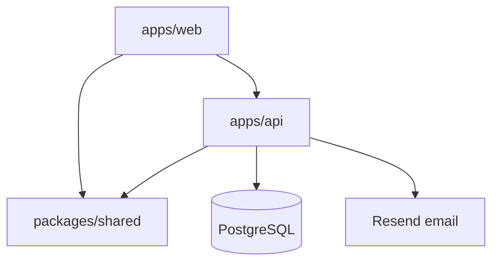

# Architecture

Wordlopol is a pnpm + Turborepo monorepo: Express API, React web app, shared TypeScript package.

**API reference:** [apps/api/docs/API.md](../apps/api/docs/API.md)

## System diagram

## Packages

| Path              | Role                                                 |
| ----------------- | ---------------------------------------------------- |
| `apps/api`        | REST API — auth, daily/infinite game modes, Prisma   |
| `apps/web`        | React 19 + Vite UI                                   |
| `packages/shared` | `evaluateGuess`, word pickers, **API contract DTOs** |
| `data/words.txt`  | Polish dictionary source (imported to Postgres)      |

Web and API both import types from `@wordlopol/shared` — no duplicate DTO files in apps.

## HTTP API versioning

All application endpoints are under **`/v1`** on the Express server (`/v1/auth`, `/v1/daily`, `/v1/infinite`, `/v1/user`, `/v1/health`).

| Layer            | Example                           |
| ---------------- | --------------------------------- |
| Browser (Vite)   | `GET /api/v1/daily/today`         |
| Express (direct) | `GET /v1/daily/today`             |
| Infra probe      | `GET /health` (unversioned alias) |

`/api` is the gateway prefix in front of the web app only — not an API version. Package semver (`apps/api` `0.x`) tracks releases, not the HTTP contract.

## Data model (core)

- **User** — email/password auth, `emailVerifiedAt`, `displayName`
- **RefreshToken** — hashed refresh tokens for session rotation
- **Word** — dictionary entries (5-letter Polish words)
- **DailyChallenge** — one word per calendar day (`Europe/Warsaw`)
- **DailyWordPool** — ordered pool for infinite mode
- **GameResult** + **UserStats** — per-user play history and aggregates

## Game modes (v1)

| Mode     | Who                         | Server role                                         |
| -------- | --------------------------- | --------------------------------------------------- |
| Daily    | Guests + registered         | Validate guesses; persist stats for logged-in users |
| Infinite | Registered + verified email | Serve pool words in order; track progress           |

Rules: 5 letters, 6 guesses; Polish diacritics matter. Guess scoring lives in `packages/shared` (`evaluateGuess`).

## Auth

Email + password (not OAuth).

| Token         | Where           | Purpose                                          |
| ------------- | --------------- | ------------------------------------------------ |
| Access JWT    | Memory (web)    | `Authorization: Bearer` on API calls (~15 min)   |
| Refresh token | httpOnly cookie | Silent re-auth; hashed in DB; rotated on refresh |

Security highlights: separate JWT secrets, refresh never in JS, rate limits on auth endpoints, revoke all sessions on password change / account delete. Details and endpoint list: [API.md](../apps/api/docs/API.md).

## Tests

| App | Layout                                                   |
| --- | -------------------------------------------------------- |
| API | `src/__tests__/` (Supertest), `src/__e2e__/` (real HTTP) |
| Web | `src/__tests__/` (Vitest + Testing Library)              |

CI runs `pnpm test:all` with Postgres on port 5433.
