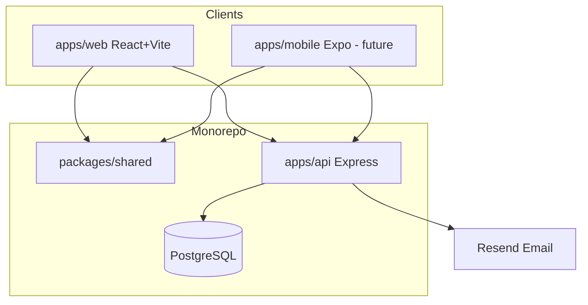
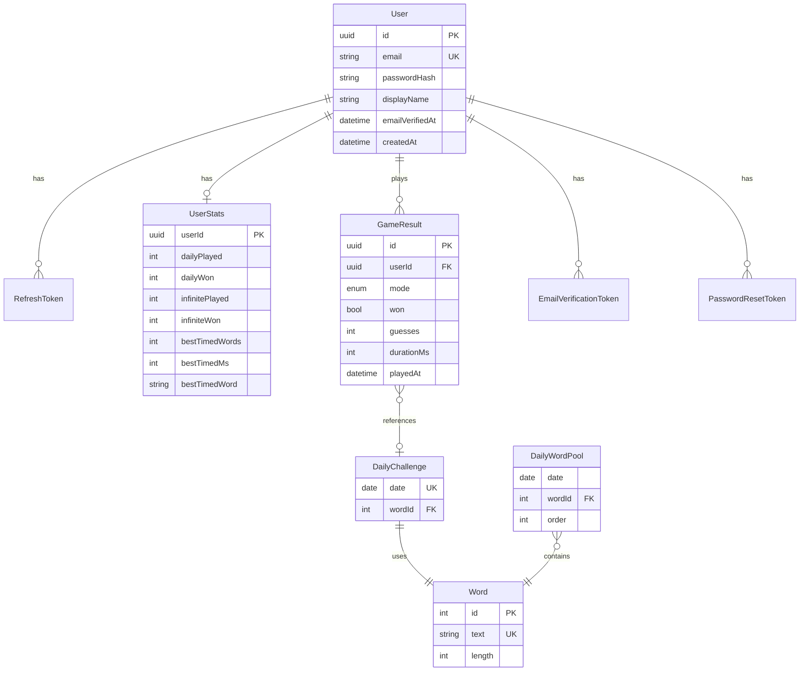
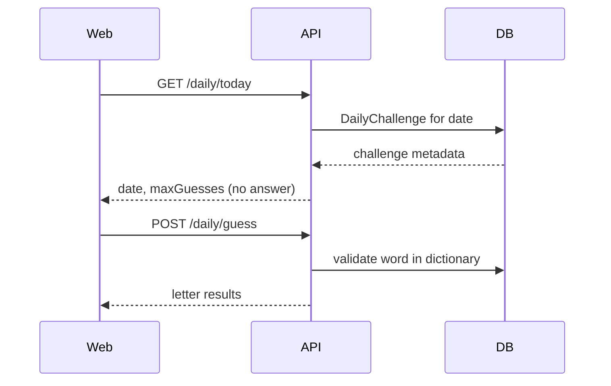
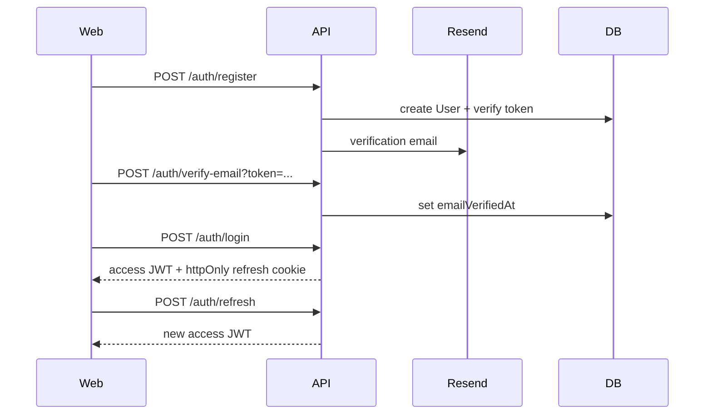
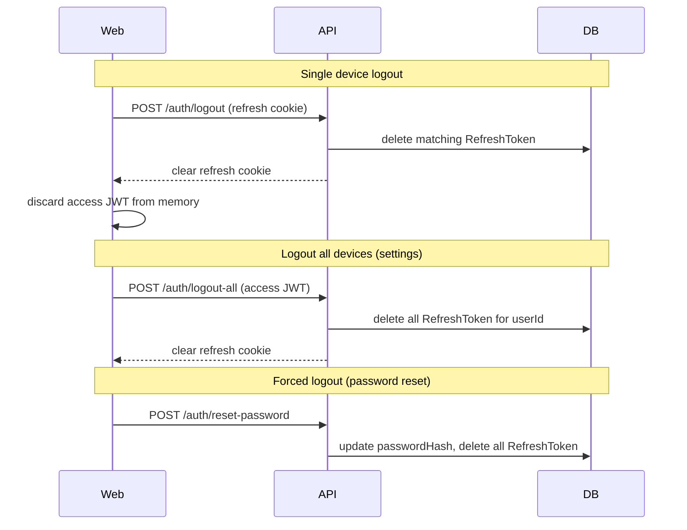

# Architecture & Data Flow

## System overview



## Monorepo packages

| Package                  | Role                                        |
| ------------------------ | ------------------------------------------- |
| `apps/api`               | REST API, Prisma, auth, game state          |
| `apps/web`               | Browser game UI                             |
| `packages/shared`        | Pure game logic, shared types (no React/DB) |
| `packages/eslint-config` | Shared ESLint rules                         |
| `packages/tsconfig`      | Shared TypeScript configs                   |

## Data model



## Game modes (v1)

| Mode     | Who                   | Persistence                                               |
| -------- | --------------------- | --------------------------------------------------------- |
| Daily    | Guests + registered   | Server stats for registered only; guests play client-side |
| Infinite | Registered (verified) | Server-validated, stats on profile                        |

### Rules

- 5 letters, 6 guesses (Polish diacritics matter)
- Daily: one word per calendar day (`Europe/Warsaw`)
- Infinite: words from today's `DailyWordPool`, served in order

## Daily mode flow



Guests: evaluate guesses in `packages/shared` locally using answer fetched only after game ends (or use server for validation without persistence).

Registered: server validates and persists `GameResult` + updates `UserStats`.

## Auth flow



### Token strategy

| Token          | Storage                              | Lifetime | Purpose                                        |
| -------------- | ------------------------------------ | -------- | ---------------------------------------------- |
| Access JWT     | Memory (web) / secure store (mobile) | 15 min   | API auth via `Authorization: Bearer`           |
| Refresh token  | httpOnly `Secure` `SameSite` cookie  | 7 days   | Silent re-auth; hashed in `RefreshToken` table |
| Email verify   | URL query param                      | 24 h     | One-time account activation                    |
| Password reset | URL query param                      | 1 h      | One-time password change                       |

**Not OAuth** — v1 uses email + password. Your API issues its own JWTs after login.

### Token security

- **Separate secrets**: `JWT_ACCESS_SECRET` and `JWT_REFRESH_SECRET` (min 32 chars each)
- **Short access TTL**: limits damage if access token leaks (XSS)
- **Refresh token never in JS**: httpOnly cookie only — not readable by frontend scripts
- **Hashed refresh tokens in DB**: store SHA-256 hash, never plaintext — enables revocation
- **Rotation on refresh**: each `POST /auth/refresh` issues a new refresh token and invalidates the old one (detects token theft)
- **HTTPS in production**: required for `Secure` cookies
- **CORS**: `credentials: true` only for `APP_URL` origin
- **Rate limiting**: on `/auth/login`, `/auth/register`, `/auth/forgot-password`
- **Invalidate on sensitive actions**: password change, email change, account delete → delete all `RefreshToken` rows for user
- **JWT claims**: `sub` (user id), `iat`, `exp` only — no sensitive data in payload

### Logout flows



| Endpoint                | When                                        | Effect                                      |
| ----------------------- | ------------------------------------------- | ------------------------------------------- |
| `POST /auth/logout`     | User clicks "Wyloguj"                       | Revoke current refresh token + clear cookie |
| `POST /auth/logout-all` | Settings → "Wyloguj ze wszystkich urządzeń" | Revoke all refresh tokens for user          |
| Password reset / change | Security event                              | Auto-revoke all sessions                    |
| Account delete          | User deletes account                        | Cascade delete all tokens + user data       |

Access JWT cannot be revoked instantly (stateless) — it expires in 15 min. Refresh revocation prevents new access tokens.

## API routes (Phase 2+)

### Auth

| Method | Path                    | Auth    | Description                                |
| ------ | ----------------------- | ------- | ------------------------------------------ |
| POST   | `/auth/register`        | —       | Create account, send verify email          |
| POST   | `/auth/verify-email`    | —       | Confirm email                              |
| POST   | `/auth/login`           | —       | Issue tokens                               |
| POST   | `/auth/logout`          | refresh | Revoke current refresh token, clear cookie |
| POST   | `/auth/logout-all`      | user    | Revoke all refresh tokens for user         |
| POST   | `/auth/refresh`         | refresh | Rotate refresh token, issue new access JWT |
| POST   | `/auth/forgot-password` | —       | Send reset email                           |
| POST   | `/auth/reset-password`  | —       | Set new password                           |
| PATCH  | `/auth/change-password` | user    | Change password                            |
| PATCH  | `/auth/change-email`    | user    | Request email change                       |
| DELETE | `/auth/account`         | user    | Delete account                             |

### Game

| Method | Path              | Auth     | Description             |
| ------ | ----------------- | -------- | ----------------------- |
| GET    | `/daily/today`    | optional | Today's challenge info  |
| POST   | `/daily/guess`    | optional | Validate guess          |
| GET    | `/infinite/next`  | user     | Next word from pool     |
| POST   | `/infinite/guess` | user     | Validate infinite guess |

### User

| Method | Path            | Auth | Description     |
| ------ | --------------- | ---- | --------------- |
| GET    | `/user/profile` | user | Profile + stats |

## Guess evaluation

Shared in `packages/shared`:

```typescript
type LetterResult = 'correct' | 'present' | 'absent';
evaluateGuess(guess: string, answer: string): LetterResult[]
```

Wordle duplicate-letter rules apply.

## Security notes

- Passwords: bcrypt (cost 12)
- JWT access + refresh strategy (see Token security above)
- Logout revokes refresh tokens server-side; access JWT expires naturally
- Rate limit auth endpoints
- CORS: allow `APP_URL` only
- Helmet for HTTP headers
- Never return answer in API until game over

## Future extensions

See [05-future-features.md](./05-future-features.md) for timed mode, multiplayer WebSockets, and Expo mobile.
