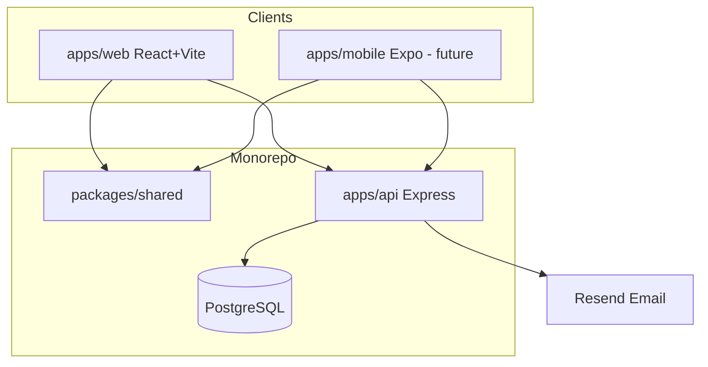
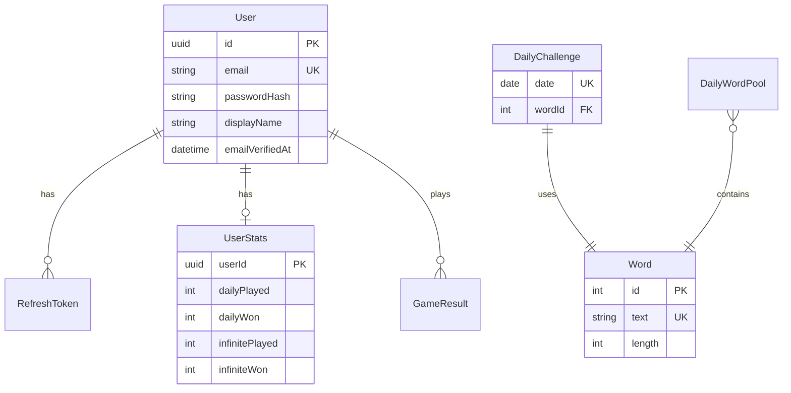

# Architecture reference

High-level design for Wordlopol. **API details:** [apps/api/docs/API.md](../apps/api/docs/API.md).

## System overview

## Monorepo packages

| Package           | Role                                    |
| ----------------- | --------------------------------------- |
| `apps/api`        | REST API, Prisma, auth, game state      |
| `apps/web`        | Browser game UI                         |
| `packages/shared` | Pure game logic + **API contract DTOs** |
| `packages/*`      | ESLint + TypeScript shared configs      |

Web and API import request/response types from `@wordlopol/shared` — no duplicate DTO files in app code.

## Data model

## Game modes (v1)

| Mode     | Who                   | Persistence                        |
| -------- | --------------------- | ---------------------------------- |
| Daily    | Guests + registered   | Server stats for registered users  |
| Infinite | Registered (verified) | Server-validated; stats on profile |

- 5 letters, 6 guesses; Polish diacritics matter
- Daily: one word per calendar day (`Europe/Warsaw`)
- Infinite: words from today's `DailyWordPool`, served in order

## Shared game logic

`packages/shared` exports `evaluateGuess`, word pickers, and DTOs (`GuessResultDto`, `DailyChallengeDto`, auth types, etc.). Wordle duplicate-letter rules apply.

## Auth (summary)

Email + password (not OAuth). Access JWT in memory (web); refresh token in httpOnly cookie, hashed in DB, rotated on refresh.

### Token security

- Separate `JWT_ACCESS_SECRET` / `JWT_REFRESH_SECRET` (min 32 chars)
- Short access TTL (~15 min); refresh never exposed to JS
- Refresh rotation + server-side revocation on logout, password change, account delete
- Rate limits on register/login/forgot-password
- CORS: `credentials: true` for `APP_URL` only

Full auth flows, endpoints, and Postman checklist: [API.md](../apps/api/docs/API.md).

## Future

[05-future-features.md](./05-future-features.md) — timed mode, multiplayer, mobile.
